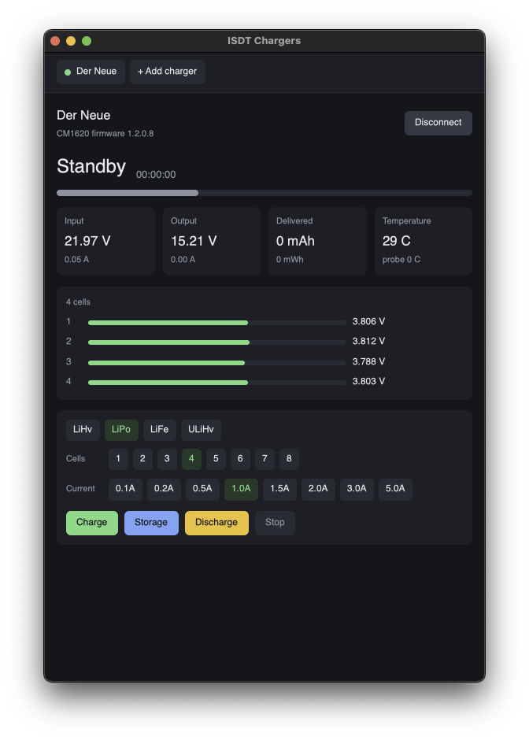

# ISDT Control

Talk to ISDT battery chargers over Bluetooth Low Energy, from a terminal, a
desktop window, or your own Rust program.

Live telemetry, task control, per-cell voltages and internal resistance, power
limits, the button-press profile, BattGo smart batteries, calibration and
firmware transfer.



## Devices

Only the CM1620 has been tested against real hardware. The rest share the same
command set and should work, but nothing here has confirmed them.

| Model | Status |
|---|---|
| CM1620 | Verified: telemetry, task control, binding, per-cell readings |
| P30, P8 host, K4 L, X12, X16 | Same command set, untested |
| H605 Air | Same command set, untested |
| FD200 | Partial. Shares task control, BattGo and one-key launch, but reports telemetry differently |
| ESC70, ESC90, BR360 | Not supported. Speed controllers rather than chargers, on a separate command range |

If you have one of the untested models, see [Contributing](#contributing); a
single run settles more than any amount of reading.

## Layout

Three crates, so the backend is usable without either front end.

| Crate | What it is |
|---|---|
| [`api`](crates/api) | The backend: wire protocol, Bluetooth link, and a client generic over the transport |
| [`cli`](crates/cli) | The command line tool `isdtctl` |
| [`gui`](crates/gui) | A desktop window `isdtgui`, built on gpui. Finds and binds chargers, and follows several at once |

Neither front end has privileged access to the backend. Anything they do, your
own program can do, and `crates/api/examples/custom_link.rs` shows the client
driving a charger over a transport the crate knows nothing about.

`PROTOCOL.md` documents the wire format.

## Installing

Prebuilt archives for each release are on the
[releases page](../../releases), one per platform:

| Platform | Targets |
|---|---|
| macOS | Apple silicon and Intel |
| Linux | x86-64 and arm64 |
| Windows | x86-64 and arm64 |

Each archive holds `isdtctl`, `isdtgui` where it built, the documentation and
a `.sha256` beside it. The window is best effort outside macOS; when it did not
build for a platform the archive says so instead of quietly omitting it.

## Building

```
cargo build --release
```

The binaries land at `target/release/isdtctl` and `target/release/isdtgui`.

On macOS the programs need Bluetooth permission. Grant it to your terminal
under System Settings, Privacy and Security, Bluetooth. Without it the system
stays silent rather than refusing, so if nothing is ever found run
`cargo run -p api --example probe` to tell a permission problem apart from a
charger that is not advertising.

The window additionally needs the macOS SDK path set at build time; see the
[`gui`](crates/gui) README.

## Binding comes first

A charger disconnects any client that has not bound, about five seconds after
connecting, so every command needs a client identifier. There is nothing to
look up: you invent one, the charger stores it, and it expects the same one
back on every later connection.

Put the charger into binding mode from its own menu, then:

```
isdtctl scan                  # the BINDING column shows "waiting"
isdtctl -d <address> bind     # generates, binds, and saves the identifier
isdtctl tokens                # what this host has stored
```

Identifiers live in `~/.config/isdtctl/tokens`, shared with the window.
**Keep that file.** A charger cannot tell you its identifier back, so losing it
means putting the charger into binding mode and binding again. `--client-id`
supplies one from elsewhere.

## Command line

```
isdtctl scan
isdtctl info
isdtctl status
isdtctl watch --interval 200
```

Start and stop tasks:

```
isdtctl charge --battery lipo --cells 4 --current-ma 2000
isdtctl storage --battery lipo --cells 4 --current-ma 1000
isdtctl discharge --battery lipo --cells 4 --current-ma 1000
isdtctl stop
```

Target voltage defaults to the chemistry's own value for the task. Override it
with `--volt-mv`. Range checks are applied by default and `--force` skips them.

Settings, smart batteries and power supplies:

```
isdtctl limits
isdtctl limits --min-volt 12 --power 600
isdtctl onekey --set --enabled --battery lipo --cells 4 --current-ma 2000
isdtctl name "Bench charger"
isdtctl battgo state
isdtctl smartpower info
```

Anything the tool does not model goes out as raw bytes:

```
isdtctl raw "e4 00"
```

`--json` gives machine-readable output for every read command.

### Interactive session

Binding and connecting cost a few seconds each time, so for anything
exploratory open a session instead:

```
isdtctl -d <address> shell
```

It connects once, binds once, and holds the link open. Every command works
inside it with the same syntax, with history and line editing. Add `--json` to
any read command for that line only. `exit`, `quit` or Ctrl-D leaves; Ctrl-C
clears the current line. A failed command reports and returns you to the prompt
rather than ending the session.

```
CM1620 Bench> status
CM1620 Bench> charge --battery lipo --cells 4 --current-ma 1000
CM1620 Bench> stop
```

An idle session polls every twenty seconds, so a lost link is reported rather
than discovered the next time you type.

## Window

```
isdtgui
```

Opens on a scan, binds chargers, and keeps several connected at once, each in
its own tab with its own controls. See the [`gui`](crates/gui) README.

## Library

```rust
use std::time::Duration;
use api::{tokens, BatteryKind, Client, LinkType, TaskType};

let client_id = tokens::parse("9102782c5bfb5047a4533d071feb6eca")?;
let mut charger =
    Client::discover_bound(None, Duration::from_secs(10), Default::default(), client_id).await?;

let state = charger.work_state(0).await?;
println!("{} at {}%", state.state.label(), state.capacity_percent);

charger.start_task(
    0, TaskType::Charge, BatteryKind::LiPo, LinkType::SerialOnly,
    2000, 4, 4200,
).await?;
```

The layers are separable, so take as much or as little as you need.

| Layer | Use it when |
|---|---|
| `frame` | You have bytes and want framing, stuffing and checksums |
| `request`, `response` | You have a link and want the packet layer, with no I/O |
| `Link` | You have a serial port or a bridge and want the whole client |
| `Client` | You want a charger on Bluetooth and no ceremony |

`Client` is generic over the `Link` trait and knows nothing about Bluetooth.
Turn the `ble` feature off to drop the Bluetooth stack entirely and keep the
protocol and the trait.

## Care

`start_task` puts real current through a real battery. Nothing here
second-guesses a request beyond the range checks noted above.

### `flash` has never been run against hardware

`isdtctl flash` is the one command that can permanently break a charger, and it
is the one command nothing here has ever executed on a real device. The frame
layouts are checked, but the sequence has only ever been reasoned about:

```
enter bootloader → erase region → write 128 byte blocks → verify checksum
```

Every step of that is untested, including whether the charger recovers if it is
interrupted part way through. There is no known way to recover a charger left
without working firmware other than whatever the manufacturer provides. The
`--address` you pass is not validated against anything, and an image written to
the wrong offset is the same failure.

Do not use it on a charger you are not prepared to lose. `--yes` is required
for exactly this reason.

`calibrate` is also untested, though the worst case is milder: wrong
calibration constants make readings inaccurate, and
`isdtctl calibrate --restore` puts the factory set back.

Everything else in this README has been exercised against a CM1620.

### Two behaviours worth knowing

A charger swallows the first control frame after a bind and drops the
occasional packet besides, so requests are resent when one goes unanswered. The
firmware operations and the reboot are sent exactly once instead, since
repeating those is not safe.

And a charger answers almost nothing until notifications are enabled on both of
its characteristics, which the Bluetooth backend does for you.

## Contributing

The most useful thing anyone can add here is a device other than a CM1620.
Everything in the table above beyond that one model is inference from a shared
command set, and a single run tells more than any amount of reading.

If you have one, bind it and send the output of:

```
isdtctl info
isdtctl --json status
```

That is enough to say whether a model works. If something is wrong, these show
what the charger actually sent:

```
cargo run -p api --example dump -- <address> <client-id>
```

It walks the GATT table, subscribes to everything, sends each query in turn and
prints every byte that comes back, decoded where possible. `ISDT_GUI_TRACE=1`
does the same for the window's side of things.

Worth reporting even when it works, so the table can stop saying untested.
Reports on `flash` are not expected and not encouraged; see above.

Field layouts and units are documented in `PROTOCOL.md`, along with the places
where a value's meaning is still unknown. Those gaps are the other thing a new
device might settle.

Every push is built on Linux, macOS and Windows, with formatting, lint, tests
and docs checked, so a pull request will tell you quickly if something is off.
Pushing a `v*` tag builds all six targets and opens a draft release.
